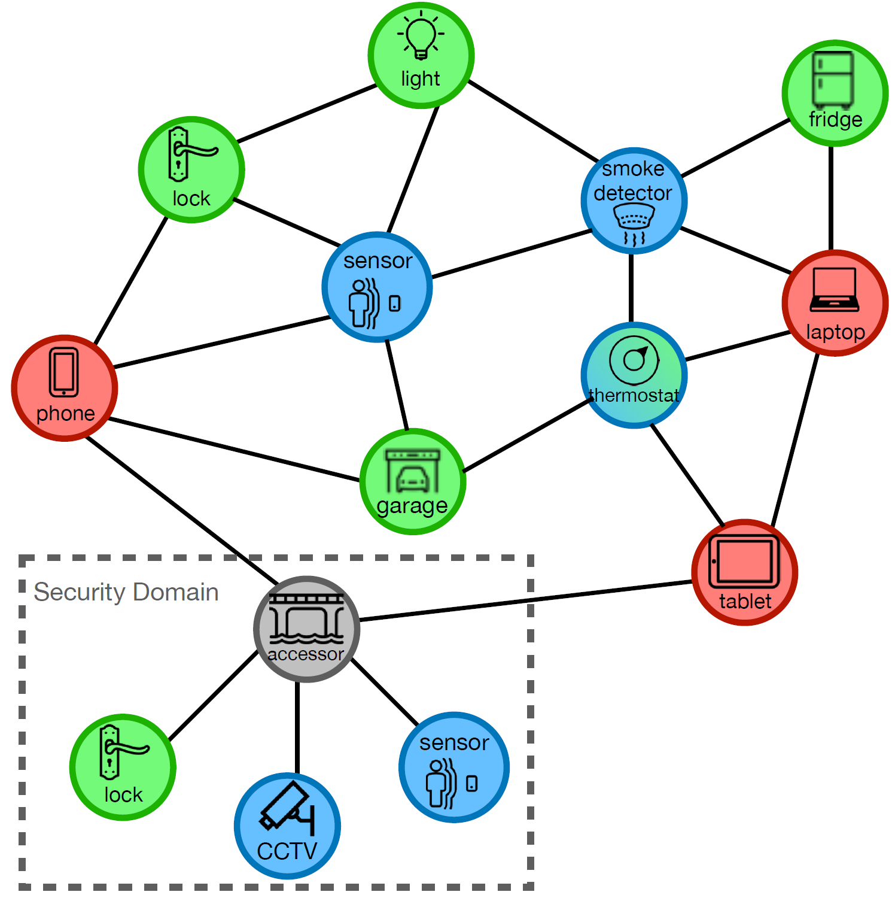
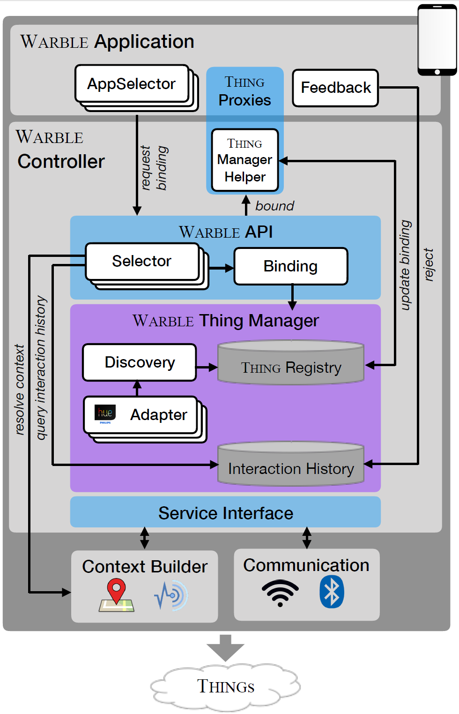

# Warble3

## What is Warble?
A flexible and expressive middleware for IoT applications. It focuses on
the personalization, interoperability, and simplicity of programming.
Warble encapsulates device and communication protocol complexities,
representing the interaction to the IoT devices as flexible programming
abstractions.

## Development Status : Ongoing
The current version has both Warble and an example of Warble application
(in Android) together in the same repository. The reason is because
Warble is in early development. Therefore, this repository has an Android
project structure. In the near future, we are going to refactor this repository
to have Warble and the application sample to be separated.

## Warble IoT Structure

Warble views the IoT structure differently compared to the today's
practice of IoT. IoT devices are divided into two main classes,
*Controllers* and *Things*. Things are devices embedded in the environment
and providing services as sensors and/or actuators. Controllers are
users' personal devices that host personal applications that interact
with the things.

## Warble Components

### Warble API
### Thing Proxy
### Binding
### Selector
### Interaction History